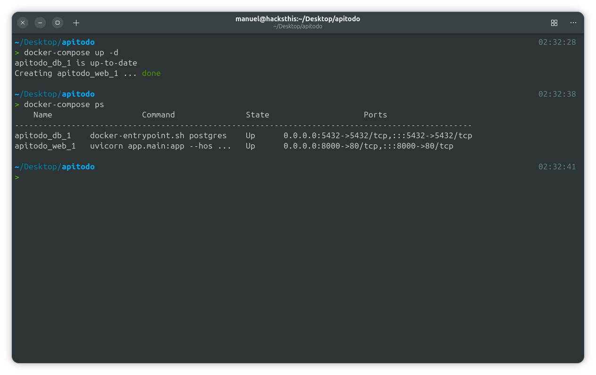

# fastapi-clean-architecture

## description
FastAPI project for technical test RestAPI Application.



## concept
1. Minimal functionality.
2. Convincing architecture.
3. Easy to read.
4. Compatibility.
5. Versatility.

## base models
1. user
2. tasks

## integrated with
1. Python (per requirements.txt / container image)
2. FastAPI
3. SQLModel / SQLAlchemy
4. Alembic
5. Dependency Injector
6. passlib[bcrypt], python-jose
7. Loguru (structured logging)
 Env vars (optional):
   - `ADMIN_EMAIL` (default: `admin@local`)
   - `ADMIN_PASSWORD` (default: `admin`)
   - `ADMIN_NAME` (default: `Administrator`)

Run migrations to create schema and seed the admin:

```sh
export ADMIN_EMAIL=admin@local
export ADMIN_PASSWORD=admin
export ADMIN_NAME="Administrator"
alembic upgrade head
```

In Docker Compose, add these env vars to the web service and run `alembic upgrade head` during startup (or rely on your entrypoint to run migrations).
   5. Modeling with schema (1:1, 1:n, n:n)
4. dependency-injector
   1. service-repository pattern
5. JWT authentication
   1. role separation each endpoint
6. Deployment
   1. container environment(k8s, docker)
   2. raw WAS(Web Application Server)

## commands
1. db(alembic)
   1. `alembic upgrade head`: apply every migrations
   2. `alembic downgrade base`: rollback every migrations
   3. `alembic revision --autogenerate -m "revision_name"`: create new migration 
   4. `alembic history`: get alembic revision history
2. How to migration
   1. Create or modify models from `app/model/*.py`
---

# Full Documentation

## Overview
This project is a clean-architecture FastAPI service with JWT authentication, SQLModel (SQLAlchemy) persistence, and Alembic migrations. It exposes:
- API v2: Authentication (sign-in, sign-up, me)
- API v1: Tasks CRUD (scoped per user)

Stack:
- FastAPI, Starlette
- Pydantic v2 (schemas)
- SQLModel + SQLAlchemy (ORM)
- Alembic (migrations)
- Dependency Injector (DI)
- passlib[bcrypt], python-jose (auth)
- Docker + docker-compose
- Pytest integration tests

## Architecture & Design Patterns
- Layered architecture
   - API Routers: `app/api/v1/*`, `app/api/v2/*`
   - Services: `app/services/*` (business logic)
   - Repositories: `app/repository/*` (DB access)
   - Models (ORM): `app/model/*` (SQLModel tables)
   - Schemas (DTO): `app/schema/*` (Pydantic validation)
   - Core: `app/core/*` (config, DB, security, DI)

- Design patterns
   - Dependency Injection (dependency-injector): `app/core/container.py`, `Provide[...]` + `@inject` in endpoints
   - Repository pattern: `BaseRepository` and concrete repositories (e.g., `TaskRepository`)
   - Service layer: encapsulates business rules (e.g., ownership checks in `TaskService`)
   - DTOs/Schemas: separate request/response validation from ORM models

## Security
- Password hashing: `passlib` with `bcrypt` via `app/core/security.py`
- JWT tokens (HS256): issued via `create_access_token()`, validated by dependency `get_current_user`
- Auth endpoints (v2): `POST /api/v2/auth/sign-up`, `POST /api/v2/auth/sign-in`, `GET /api/v2/auth/me`
- Authorization on Tasks: all `/api/v1/tasks*` require Bearer token; users only access their own tasks

## Data Model (simplified)
- `User`: id, email (unique), password (hashed), user_token (unique), name, is_active, is_superuser, timestamps
- `Task`: id, titulo, descripcion?, estado, fecha_creacion, id_usuario (FK → user.id), timestamps

## ORM & Migrations
- ORM: SQLModel (on top of SQLAlchemy)
- Alembic
   - Metadata is from `SQLModel.metadata` (see `alembic/env.py`).
   - Initial schema migration (sync models).
   - Data migration to seed default admin: `20250904_create_default_admin.py`.

Default superuser seeding
- Env vars:
   - `ADMIN_EMAIL` (default `admin@local`)
   - `ADMIN_PASSWORD` (default `admin`)
   - `ADMIN_NAME` (default `Administrator`)
- The data migration only inserts if no superuser exists and that email isn't present.

How to create migrations
1) Edit or add SQLModel models under `app/model/*.py`
2) Autogenerate a migration:
```sh
alembic revision --autogenerate -m "your_message"
```
3) Apply migrations:
```sh
alembic upgrade head
```
4) Rollback (optional):
```sh
alembic downgrade -1
```

## Running locally (no Docker)
Install dependencies and run Uvicorn (example):
```sh
python -m venv .venv
source .venv/bin/activate
pip install -r requirements.txt
export ENV=dev
export DB=postgresql
export DB_USER=todo_user
export DB_PASSWORD=todo_pass
export DB_HOST=localhost
export DB_PORT=5432
alembic upgrade head
uvicorn app.main:app --reload --port 8000
```

## Docker / Docker Compose
docker-compose.yml defines:
- `db`: Postgres
- `web`: FastAPI app (Uvicorn on port 80; exposed as 8000)

Quick start:
```sh
docker compose up -d --build
docker compose exec web alembic upgrade head
```

Optional: seed admin by env (already in compose under web.environment):
```sh
export ADMIN_EMAIL=admin@local
export ADMIN_PASSWORD=admin
export ADMIN_NAME="Administrator"
docker compose exec web alembic upgrade head
```

Base URL: `http://localhost:8000`

Notes
- Supported DB engines: `postgresql` and `mysql` (set `DB` accordingly).
- Database name is chosen by `ENV` via mapping: dev → `dev-todo`, stage → `stage-todo`, prod → `todo`.
- Optional: run migrations automatically at container start by adding an entrypoint that executes `alembic upgrade head`.

Logging in containers
- Control log output with env vars (see Logging section): set `LOG_LEVEL=INFO` or `DEBUG`, `LOG_JSON=true` to emit JSON logs, and optionally `LOG_FILE` to write to a rotating file.

## cURL Examples
Set base URL and JSON header:
```sh
BASE=http://localhost:8000
HDR='Content-Type: application/json'
```

Health check:
```sh
curl -s $BASE/
```

Auth - Sign Up:
```sh
curl -s -X POST "$BASE/api/v2/auth/sign-up" \
   -H "$HDR" \
   -d '{"email":"user@demo.com","password":"pass","name":"User"}'
```

Auth - Sign In (note: email__eq):
```sh
TOKEN=$(curl -s -X POST "$BASE/api/v2/auth/sign-in" \
   -H "$HDR" \
   -d '{"email__eq":"user@demo.com","password":"pass"}' | jq -r .access_token)
echo $TOKEN
```

Auth - Me:
```sh
curl -s "$BASE/api/v2/auth/me" -H "Authorization: Bearer $TOKEN"
```

Tasks - Create:
```sh
curl -s -X POST "$BASE/api/v1/tasks" \
   -H "$HDR" -H "Authorization: Bearer $TOKEN" \
   -d '{"titulo":"t1","descripcion":"d1","estado":"pendiente"}'
```

Tasks - List:
```sh
curl -s "$BASE/api/v1/tasks" -H "Authorization: Bearer $TOKEN"
```

Tasks - Get by ID:
```sh
TASK_ID=1
curl -s "$BASE/api/v1/tasks/$TASK_ID" -H "Authorization: Bearer $TOKEN"
```

Tasks - Update:
```sh
curl -s -X PUT "$BASE/api/v1/tasks/$TASK_ID" \
   -H "$HDR" -H "Authorization: Bearer $TOKEN" \
   -d '{"titulo":"t1-upd","estado":"en_progreso"}'
```

Tasks - Delete:
```sh
curl -s -X DELETE "$BASE/api/v1/tasks/$TASK_ID" -H "Authorization: Bearer $TOKEN" -i
```

Admin sign-in (if seeded):
```sh
curl -s -X POST "$BASE/api/v2/auth/sign-in" \
   -H "$HDR" \
   -d '{"email__eq":"admin@local","password":"admin"}'
```

## Testing
Run all tests:
```sh
pytest -q
```

## Troubleshooting
- Ensure DB URL matches your environment (alembic.ini vs runtime envs)
- Run `alembic upgrade head` before using the API
- If `jq` is not installed, inspect raw JSON instead of using the TOKEN one-liners
 - Bcrypt warning during Alembic runs is benign with passlib + bcrypt 4.x and can be ignored.


## Logging (Loguru)
Centralized logging is configured via `app/core/logging.py` and enabled in `app/main.py`. A request/response middleware (`RequestLoggingMiddleware` in `app/core/middleware.py`) logs each request with a correlation id.

Highlights
- Stdlib/uvicorn logs are intercepted and unified by Loguru.
- Request logs include method, path, status, and latency; a `X-Request-ID` is added to responses.
- Pretty console output by default; optional JSON logs and file sink with rotation/retention.

Environment variables
- `LOG_LEVEL` (default: `INFO`) — e.g., `DEBUG`, `WARNING`.
- `LOG_JSON` (default: `false`) — set to `true` for JSON structured logs.
- `LOG_FILE` (optional) — path to a log file to enable file sink.
- `LOG_ROTATION` (default: `10 MB`) — size/time-based rotation policy.
- `LOG_RETENTION` (default: `7 days`) — retention policy.

Example
```sh
export LOG_LEVEL=DEBUG
export LOG_JSON=false
# optional file sink
# export LOG_FILE=/var/log/app.log
```

Security note: authentication logs never include passwords or raw JWT secrets.


## Ignore files (.gitignore and .dockerignore)
Both ignore files are included at the repo root to keep the workspace clean and Docker images slim.

- `.gitignore`: ignores Python build artifacts and caches (`__pycache__/`, `*.py[cod]`, `.pytest_cache/`, `htmlcov/`), virtual envs (`.venv/`, `venv/`), local env and secrets (`.env`, `.env.*`), coverage and linter caches (`.coverage*`, `.mypy_cache/`, `.ruff_cache/`), IDE/OS files (`.vscode/`, `.idea/`, `.DS_Store`), and Alembic `__pycache__`.
- `.dockerignore`: excludes VCS and local-only files from Docker context (e.g., `.git`, `__pycache__/`, `.venv/`, `.pytest_cache/`, `.env`, `docker-compose.override.yml`, editor/OS files). This speeds up builds and reduces image context size.

You can adjust these lists if you want to include tests or coverage in the build context for CI images.


## sample env
```dotenv
# mysql case
ENV=dev
DB=mysql
DB_USER=root
DB_PASSWORD=qwer1234
DB_HOST=localhost
DB_PORT=3306

# postgres case
ENV=dev
DB=postgresql
DB_USER=gyu
DB_PASSWORD=
DB_HOST=localhost
DB_PORT=5432
```

## references
1. [FastAPI official docs](https://fastapi.tiangolo.com/)
2. [alembic official tutorial](https://alembic.sqlalchemy.org/en/latest/tutorial.html)
3. [Dependency Injector](https://python-dependency-injector.ets-labs.org/)
